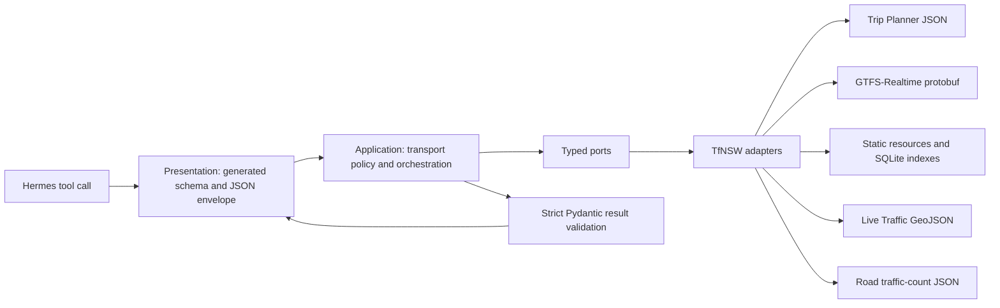

# Hermes Sydney Transport

[](https://github.com/hongfeiyang/hermes-sydney-transport/actions/workflows/test.yml)
[](pyproject.toml)
[](LICENSE)

A reusable [Hermes Agent](https://hermes-agent.nousresearch.com/docs/) plugin for
Sydney public transport and NSW road data. It combines TfNSW Trip Planner,
GTFS-Realtime Trip Updates, Vehicle Positions, Alerts v2, static accessibility and
Complete GTFS timetable resources, Live Traffic hazards, and historical NSW Roads
traffic-volume counts.

It currently exposes 22 strict, model-visible tools. Every result includes source
provenance and keeps uncertainty explicit instead of silently turning missing or
stale data into facts.

> Project status: alpha. The plugin has deterministic tests, packaging checks, and
> an architecture harness, but live upstream coverage still depends on TfNSW feeds
> and published datasets.

This independent project is not affiliated with or endorsed by Transport for NSW,
Sydney Trains, Sydney Metro, NSW TrainLink, or NSW Roads.

## What it offers

| Capability | What an agent can answer | Source |
|---|---|---|
| Stop discovery | “What is the TfNSW stop ID for Central?” | TfNSW Trip Planner |
| Nearby transport | “Which stops are near these coordinates?” | TfNSW Trip Planner |
| Departures | Planned/estimated departures for train, bus, metro, light rail and ferry, platforms, destinations, `service_id` | TfNSW Trip Planner |
| Journey planning | Five-mode journeys, transfers, wheelchair filtering, alerts, bounded stop sequences | TfNSW Trip Planner |
| Trip Planner alerts | Current five-mode service alerts, network-wide or stop-scoped | TfNSW Trip Planner |
| Route disruptions | GTFS-Realtime route disruptions across train, bus, metro, light rail, and ferry | GTFS-Realtime Alerts v2 |
| Stop accessibility | Static facilities/lifts plus optional current accessibility warnings for one stop | Static facilities + Alerts v2 |
| Route timetable | Published Complete GTFS timetable for one exact route ID | Complete GTFS |
| Service status | Next stop, predictions, skipped stops, cancellation, platform/stop changes for one service | GTFS-Realtime Trip Updates + static GTFS |
| Vehicle position | Latest reported coordinates, stop context, freshness, confidence, optional occupancy | GTFS-Realtime Vehicle Positions + static GTFS |
| Live road hazards | Current incidents, flood, fire, alpine conditions, major events, roadworks | Live Traffic Hazards API |
| Historical road counts | Count stations, yearly summaries, bounded hourly rows | NSW Roads Traffic Volume Counts API |

Live Traffic hazards are current operational road-network data, not routing or
travel-time predictions. Traffic counts are historical published observations, not
live congestion. Missing vehicle or occupancy data means unavailable, never
stationary or empty.

## Quick start

Requirements:

- Hermes Agent 0.20.0 or a compatible release
- Python 3.12–3.13
- a [TfNSW Open Data](https://opendata.transport.nsw.gov.au/) API key

Install the standalone native plugin directly from GitHub:

```bash
hermes plugins install hongfeiyang/hermes-sydney-transport --no-enable
hermes config set TFNSW_API_KEY '<your-key>'
hermes plugins enable sydney-transport
```

Restart a long-running Hermes gateway after installation or configuration changes.
Then verify discovery:

```bash
hermes plugins list
```

Hermes stores the key in its private environment configuration. Do not put the real
value in this repository, `plugin.yaml`, source code, prompts, logs, or bug reports.
The committed [`.env.example`](.env.example) contains only an empty placeholder.

### Pip/entry-point installation

The Python package also publishes the standard `hermes_agent.plugins` entry point:

```bash
python -m pip install \
  'git+https://github.com/hongfeiyang/hermes-sydney-transport.git'
hermes plugins enable sydney-transport
```

Install it into the same Python environment that runs Hermes. The repository has not
yet published a PyPI release.

### Docker-hosted Hermes

Run the same commands through the Hermes environment inside the container. For the
standard image layout:

```bash
docker exec hermes /opt/hermes/.venv/bin/python /opt/hermes/hermes \
  plugins install hongfeiyang/hermes-sydney-transport --no-enable
docker exec hermes /opt/hermes/.venv/bin/python /opt/hermes/hermes \
  config set TFNSW_API_KEY '<your-key>'
docker exec hermes /opt/hermes/.venv/bin/python /opt/hermes/hermes \
  plugins enable sydney-transport
docker restart hermes
```

## Example conversations

```text
Find the bus stops around Railway Square.
What are the next trains and buses from Central?
Plan a wheelchair-accessible trip to Parramatta arriving by 5 pm.
Are there current train, metro, light rail, bus or ferry alerts around Circular Quay?
Show current route disruptions affecting T1, M1, L2-L3, F1, or route 333.
Does Central have lifts, and are there current accessibility warnings?
Show the published timetable for exact Complete GTFS route 2-T1-N-sj2-1 on 2026-08-17.
Where is the 6:04 pm train from Central now?
Does that service still stop at Strathfield, and has its platform changed?
Where is the 438X bus, what is its next stop, and how confident is that position?
What live road hazards are near Parramatta?
Find road traffic-count stations on the Sydney Harbour Bridge.
Show hourly sample counts for station_key 58308 on 24 May 2010.
```

## Recommended transport workflow

The normal workflow is discovery first, then detail:

1. Search for a stop.
2. Request departures using the returned `stop_id`.
3. Prefer the returned exact `service_id` for any mode-specific realtime tool.
4. Use `trip_code + stop_id (+ at)` only as a fallback resolver.
5. Use route disruptions for network/service-wide disruption context, not single-trip
   vehicle tracking.

Trip Planner `trip_code` and GTFS `service_id` are different identifiers. The plugin
never joins them using string similarity and rejects missing or ambiguous fallback
matches rather than guessing.

Complete GTFS route/trip/stop IDs returned by route timetable are also a separate
namespace and must not be reused as realtime feed identifiers.

## Tool inventory

### `sydney_transport`

- `sydney_transport_search_stops`
- `sydney_transport_nearby_stops`
- `sydney_transport_departures`
- `sydney_transport_plan_trip`
- `sydney_transport_alerts`
- `sydney_transport_route_disruptions`
- `sydney_transport_stop_accessibility`
- `sydney_transport_route_timetable`
- `sydney_transport_train_service_status`
- `sydney_transport_train_vehicle_position`
- `sydney_transport_bus_service_status`
- `sydney_transport_bus_vehicle_position`
- `sydney_transport_metro_service_status`
- `sydney_transport_metro_vehicle_position`
- `sydney_transport_light_rail_service_status`
- `sydney_transport_light_rail_vehicle_position`
- `sydney_transport_ferry_service_status`
- `sydney_transport_ferry_vehicle_position`

### `nsw_traffic`

- `nsw_live_traffic_hazards`
- `nsw_traffic_count_stations`
- `nsw_traffic_volume_summary`
- `nsw_traffic_volume_hourly`

See the [tool reference](docs/tool-reference.md) for inputs, outputs, mode coverage,
and recommended call sequences.

## How it works



There is one supported extension path: one `ToolSpec` in the catalog, one
application use case, one typed port boundary, and one bootstrap binding. Schemas
and handlers are generated from the catalog. An architecture checker rejects
parallel registration, handwritten schema paths, wrong-way imports, infrastructure
leakage, untyped application records, oversized policy modules, and restoration of
legacy package paths.

TfNSW integration code has one enforced internal grammar: validated endpoint
catalogs, one persistent HTTP platform, format-specific codecs, frozen Pydantic wire
models, pure mappers, transactional stores, and semantic repositories. Expected
partial-source outages travel as typed `Availability[T]`, so application policy does
not use scattered exception handling. Realtime modes have one data-only extension
point, `ModeSpec`; each row owns its policy, Alerts sources and complete endpoint bundle,
and the composition root derives both realtime tools and the isolated static cache from
that row. Mutation tests reject parallel mode tables and per-mode construction branches.

Realtime service status and vehicle position combine:

- exact service identity from departures or a fail-closed fallback resolver;
- GTFS-Realtime Trip Updates for predictions, skipped stops and cancellation;
- GTFS-Realtime Vehicle Positions for reported coordinates and optional occupancy;
- GTFS-Realtime Alerts v2 for route disruptions and current accessibility warnings;
- mode-specific static GTFS indexes for route, stop and schedule context;
- explicit freshness, join, prediction, inference and confidence evidence.

Static accessibility and timetable tools use separate bounded resources:

- location facilities and interchange-lift datasets for exact stop accessibility;
- Complete GTFS indexed into SQLite for exact route timetable lookups.

Authenticated HTTP redirects are rejected so an API key cannot cross origins.
Timeouts, retries, response sizes, archive expansion, rows and returned text are
bounded. The road-count API's PostgreSQL-shaped query parameter is never exposed:
the adapter builds only fixed, allowlisted query templates from validated semantic
input.

For the complete flow, caching and failure behavior, read
[How the plugin works](docs/how-it-works.md). The normative dependency rules are in
the [architecture contract](docs/architecture.md).

## Data semantics and limitations

- Times are normalized to `Australia/Sydney`; ambiguous or nonexistent naive DST
  times are rejected unless the caller supplies an explicit UTC offset.
- Search, departures, trip planning, Trip Planner alerts, route disruptions, and
  mode-specific realtime tools support train, bus, metro, light rail, and ferry.
  Mode lists default to train and bus for backward compatibility.
- Missing estimates remain missing and are not described as on time.
- Alerts and live hazard prose are bounded untrusted remote content, not agent
  instructions.
- Static accessibility inventory never proves current lift operation.
- Route timetable IDs come from the Complete GTFS namespace and must not be treated
  as realtime `service_id` values.
- The first Complete GTFS timetable refresh is intentionally heavy (about 28 seconds
  and a 515 MB index in the August 2026 verification). Reserve at least 1.36 GB of
  working space and pre-warm it before latency-sensitive use.
- Static GTFS indexes and caches are isolated by mode or data source.
- Realtime feeds use a short thread-safe single-flight cache; the plugin starts no
  hidden polling thread.
- Live Traffic hazards return current network impacts and planned hazards that are
  already affecting traffic; they are not route planners.
- Road-count results retain partial-year, availability, reliability and quality
  fields.
- TfNSW may omit vehicles, occupancy, predictions or classifications. Output quality
  fields explain what was observed, joined, predicted or inferred.

Hermes cron can provide opt-in commute monitoring without adding a background worker
to the plugin.

## Documentation

- [Tool reference](docs/tool-reference.md) — all 22 tools and recommended workflows
- [How the plugin works](docs/how-it-works.md) — request, realtime, static, live-hazard and traffic pipelines
- [Architecture contract](docs/architecture.md) — normative layers and dependency rules
- [TfNSW endpoint/macro map](docs/api-macros.md) — allowlisted upstream mappings
- [Engineering notes](docs/engineering-notes.md) — implementation and security decisions
- [ADRs](docs/adr/) — accepted architectural decisions
- [`llms.txt`](llms.txt) — compact machine-readable project index for AI systems

## Development

```bash
git clone https://github.com/hongfeiyang/hermes-sydney-transport.git
cd hermes-sydney-transport
python -m pip install --editable '.[dev]'
./scripts/verify.sh all
```

The verification harness checks architecture, Ruff formatting/lint, strict mypy,
deterministic tests and the built wheel contract. CI runs on Python 3.12–3.13 and
also tests minimum supported Pydantic/protobuf versions.

Read [CONTRIBUTING.md](CONTRIBUTING.md) before adding a capability. Runtime changes
must follow the repository's single extension path; weakening an architecture rule
requires an ADR.

## Official sources

- [Hermes plugin developer guide](https://hermes-agent.nousresearch.com/docs/developer-guide/plugins)
- [Hermes plugin user guide](https://hermes-agent.nousresearch.com/docs/user-guide/features/plugins)
- [TfNSW developer documentation](https://opendata.transport.nsw.gov.au/developers/documentation)
- [TfNSW GTFS/GTFS-Realtime implementation specification](https://opendata.transport.nsw.gov.au/sites/default/files/2025-09/TfNSW%20GTFS%20%20GTFS%20R%20Implementation%20Specification%20v2%20June%202025.pdf)
- [NSW Live Traffic documentation](https://opendata.transport.nsw.gov.au/documentation)
- [NSW Roads Traffic Volume Counts API dataset](https://opendata.transport.nsw.gov.au/dataset/nsw-roads-traffic-volume-counts-api)
- [NSW Road Traffic Volume Counts dataset guide](https://opendata.transport.nsw.gov.au/data/dataset/ef2b0bd2-db1e-48f3-9ea1-2bb9e6bc6504/resource/13d061b1-1606-49b5-b182-d36ce0801f14/download/rms-dataset-documentation-nsw-traffic-volume-counts_0.pdf)

## License and attribution

Plugin code is available under the [MIT License](LICENSE). TfNSW data, APIs and
documentation have separate terms and attribution requirements; consult the TfNSW
Open Data Hub before redistributing data.
