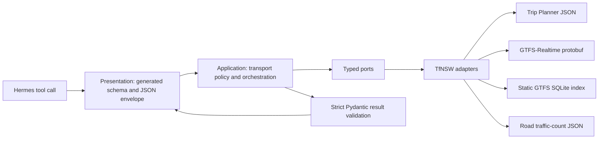

# Hermes Sydney Transport

[](https://github.com/hongfeiyang/hermes-sydney-transport/actions/workflows/test.yml)
[](pyproject.toml)
[](LICENSE)

A reusable [Hermes Agent](https://hermes-agent.nousresearch.com/docs/) plugin for
Sydney trains, Sydney buses, Transport for NSW (TfNSW) trip planning,
GTFS-Realtime service tracking, public-transport alerts, vehicle positions, and
historical NSW road traffic-volume counts.

It gives a Hermes agent 12 strict, model-visible tools backed by official TfNSW data.
Every result includes provenance and preserves missing, stale, partial, or inferred
data instead of silently turning uncertainty into facts.

> Project status: alpha. The plugin has deterministic test coverage and a strict
> architecture harness, but upstream API coverage and realtime vehicle/occupancy data
> remain dependent on TfNSW.

This independent project is not affiliated with or endorsed by Transport for NSW,
Sydney Trains, or NSW Roads.

## What it offers

| Capability | What an agent can answer | Source |
|---|---|---|
| Stop discovery | “What is the TfNSW stop ID for Central?” | TfNSW Trip Planner |
| Nearby transport | “Which stops are within 500 m of these coordinates?” | TfNSW Trip Planner |
| Departures | Planned/estimated train and bus times, platform, route, destination, delay, cancellation | TfNSW Trip Planner |
| Journey planning | Depart-after or arrive-by train/bus journeys, transfers, platforms, alerts, wheelchair filtering | TfNSW Trip Planner |
| Alerts | Current train and bus disruptions, network-wide or stop-specific | TfNSW Trip Planner |
| Service status | Next stop, stop predictions, skipped stops, cancellation and platform/stop changes for one train or bus | GTFS-Realtime Trip Updates + static GTFS |
| Vehicle position | Latest reported coordinates, stop context, freshness, confidence and optional occupancy | GTFS-Realtime Vehicle Positions + static GTFS |
| Road traffic counts | Count stations, yearly summaries and bounded hourly data | NSW Roads Traffic Volume Counts API |

Road traffic counts are historical observations published as a dataset; they are not
live congestion. Realtime vehicle and occupancy coverage is incomplete. An absent
vehicle report means “unavailable”, never “stationary”, and absent occupancy never
means “empty”.

## Quick start

Requirements:

- Hermes Agent 0.20.0 or a compatible release
- Python 3.12–3.13
- a [TfNSW Open Data](https://opendata.transport.nsw.gov.au/) API key

Install the standalone native plugin directly from GitHub:

```bash
hermes plugins install hongfeiyang/hermes-sydney-transport --no-enable
hermes config set TFNSW_API_KEY '<your-key>'
hermes plugins enable sydney-transport
```

Restart a long-running Hermes gateway after installation or configuration changes.
Then verify discovery:

```bash
hermes plugins list
```

Hermes stores the key in its private environment configuration. Do not put the real
value in this repository, `plugin.yaml`, source code, prompts, logs, or bug reports.
The committed [`.env.example`](.env.example) contains only an empty placeholder.

### Pip/entry-point installation

The Python package also publishes the standard `hermes_agent.plugins` entry point:

```bash
python -m pip install \
  'git+https://github.com/hongfeiyang/hermes-sydney-transport.git'
hermes plugins enable sydney-transport
```

Install it into the same Python environment that runs Hermes. The repository has not
yet published a PyPI release.

### Docker-hosted Hermes

Run the same commands through the Hermes environment inside the container. For the
standard image layout:

```bash
docker exec hermes /opt/hermes/.venv/bin/python /opt/hermes/hermes \
  plugins install hongfeiyang/hermes-sydney-transport --no-enable
docker exec hermes /opt/hermes/.venv/bin/python /opt/hermes/hermes \
  config set TFNSW_API_KEY '<your-key>'
docker exec hermes /opt/hermes/.venv/bin/python /opt/hermes/hermes \
  plugins enable sydney-transport
docker restart hermes
```

## Example conversations

```text
Find the bus stops around Railway Square.
What are the next trains and buses from Central?
Plan a wheelchair-accessible trip to Parramatta arriving by 5 pm.
Are there current bus disruptions around Bondi Junction?
Where is the 6:04 pm train from Central now?
Does that train still stop at Strathfield, and has its platform changed?
Where is the 438X bus and what is its next stop?
Find road traffic-count stations on the Sydney Harbour Bridge.
Show the latest yearly traffic-volume summary for station 01001.
Show hourly sample counts for station_key 58308 on 24 May 2010.
```

The normal workflow is discovery first, then detail:

1. Search for a stop.
2. Request departures using the returned `stop_id`.
3. Pass the returned exact `service_id` to a train or bus realtime tool.
4. Use `trip_code + stop_id (+ at)` only as a fallback resolver.

Trip Planner `trip_code` and GTFS `service_id` are different identifiers. The plugin
never joins them using string similarity and rejects missing or ambiguous fallback
matches rather than guessing.

## Tool inventory

### `sydney_transport`

- `sydney_transport_search_stops`
- `sydney_transport_nearby_stops`
- `sydney_transport_departures`
- `sydney_transport_plan_trip`
- `sydney_transport_alerts`
- `sydney_transport_train_service_status`
- `sydney_transport_train_vehicle_position`
- `sydney_transport_bus_service_status`
- `sydney_transport_bus_vehicle_position`

### `nsw_traffic`

- `nsw_traffic_count_stations`
- `nsw_traffic_volume_summary`
- `nsw_traffic_volume_hourly`

See the [tool reference](docs/tool-reference.md) for inputs, outputs, selection rules,
and recommended call sequences.

## How it works



There is one supported extension path: one `ToolSpec` in the catalog, one application
use case, one typed port boundary, and one bootstrap binding. Schemas and handlers are
generated from the catalog. An architecture checker rejects parallel registration,
handwritten schema paths, wrong-way imports, infrastructure leakage, untyped
application records, oversized policy modules, and restoration of legacy package
paths.

Realtime service status combines:

- exact service identity from departures or a fail-closed fallback resolver;
- GTFS-Realtime Trip Updates for predictions, cancellation and skipped stops;
- Vehicle Positions for reported coordinates and optional occupancy;
- a mode-specific static GTFS SQLite index for route, stop and schedule context;
- explicit freshness, join, prediction, inference and confidence evidence.

Authenticated HTTP redirects are rejected so an API key cannot cross origins.
Timeouts, retries, response sizes, archive expansion, rows and returned text are
bounded. The road API's PostgreSQL-shaped query parameter is never exposed: the
adapter builds only fixed, allowlisted query templates from validated semantic input.

For the complete flow, caching and failure behavior, read
[How the plugin works](docs/how-it-works.md). The normative dependency rules are in
the [architecture contract](docs/architecture.md).

## Data semantics and limitations

- Times are normalized to `Australia/Sydney`; ambiguous or nonexistent naive DST
  times are rejected unless the caller supplies an explicit UTC offset.
- Missing estimates remain missing and are not described as on time.
- Train-only TfNSW extensions are never applied to bus feeds.
- Alerts are bounded untrusted remote content, not agent instructions.
- Static train and bus GTFS indexes and caches are isolated by mode.
- Realtime feeds use a short thread-safe single-flight cache; the plugin starts no
  hidden polling thread.
- Road results retain partial-year, availability, reliability and quality fields.
- TfNSW may omit vehicles, occupancy, predictions or classifications. Output quality
  fields explain what was observed, joined, predicted or inferred.

Hermes cron can provide opt-in commute monitoring without adding a background worker
to the plugin.

## Documentation

- [Tool reference](docs/tool-reference.md) — all 12 tools and recommended workflows
- [How the plugin works](docs/how-it-works.md) — request, realtime and traffic pipelines
- [Architecture contract](docs/architecture.md) — normative layers and dependency rules
- [TfNSW endpoint/macro map](docs/api-macros.md) — allowlisted upstream mappings
- [Engineering notes](docs/engineering-notes.md) — implementation and security decisions
- [ADRs](docs/adr/) — accepted architectural decisions
- [`llms.txt`](llms.txt) — compact machine-readable project index for AI systems

## Development

```bash
git clone https://github.com/hongfeiyang/hermes-sydney-transport.git
cd hermes-sydney-transport
python -m pip install --editable '.[dev]'
./scripts/verify.sh all
```

The verification harness checks architecture, Ruff formatting/lint, strict mypy,
deterministic tests and the built wheel contract. CI runs on Python 3.12–3.13 and
also tests minimum supported Pydantic/protobuf versions.

Read [CONTRIBUTING.md](CONTRIBUTING.md) before adding a capability. Runtime changes
must follow the repository's single extension path; weakening an architecture rule
requires an ADR.

## Official sources

- [Hermes plugin developer guide](https://hermes-agent.nousresearch.com/docs/developer-guide/plugins)
- [Hermes plugin user guide](https://hermes-agent.nousresearch.com/docs/user-guide/features/plugins)
- [TfNSW developer documentation](https://opendata.transport.nsw.gov.au/developers/documentation)
- [TfNSW GTFS/GTFS-Realtime implementation specification](https://opendata.transport.nsw.gov.au/sites/default/files/2025-09/TfNSW%20GTFS%20%20GTFS%20R%20Implementation%20Specification%20v2%20June%202025.pdf)
- [TfNSW Realtime Bus technical documentation](https://opendata.transport.nsw.gov.au/sites/default/files/2024-10/TfNSW_Realtime_Bus_Technical_Doc_v4.4.pdf)
- [NSW Roads Traffic Volume Counts API dataset](https://opendata.transport.nsw.gov.au/dataset/nsw-roads-traffic-volume-counts-api)
- [NSW Road Traffic Volume Counts dataset guide](https://opendata.transport.nsw.gov.au/data/dataset/ef2b0bd2-db1e-48f3-9ea1-2bb9e6bc6504/resource/13d061b1-1606-49b5-b182-d36ce0801f14/download/rms-dataset-documentation-nsw-traffic-volume-counts_0.pdf)

## License and attribution

Plugin code is available under the [MIT License](LICENSE). TfNSW data, APIs and
documentation have separate terms and attribution requirements; consult the TfNSW
Open Data Hub before redistributing data.
