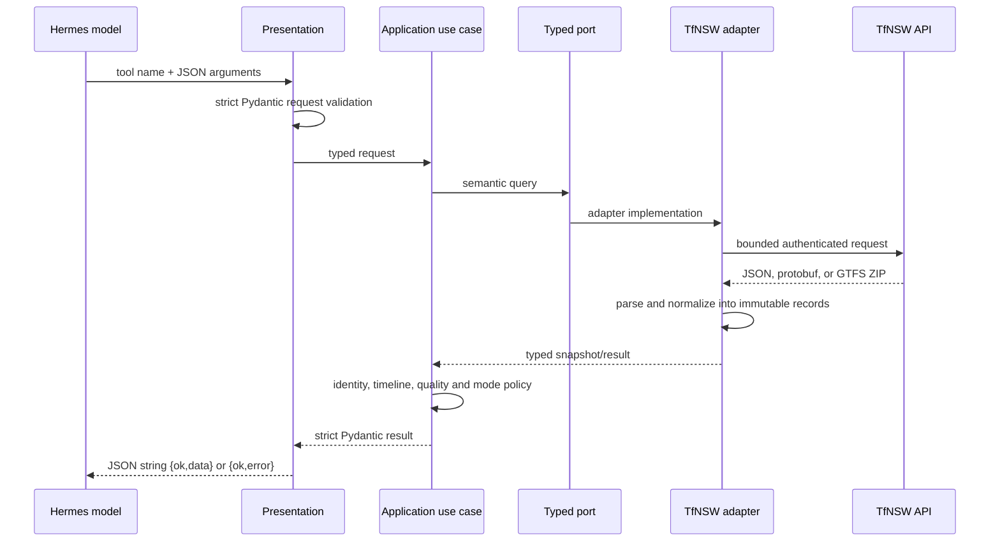

# How the plugin works

Hermes Sydney Transport is a bounded data pipeline. Each layer owns one concern and
communicates through typed contracts. This page explains the runtime behavior; the
[architecture contract](architecture.md) defines the rules enforced in CI.

## Plugin discovery and registration

The repository supports the two official reusable Hermes distribution forms:

- Native directory plugin: repository-root `plugin.yaml` plus `__init__.py` with
  `register(ctx)`.
- Python distribution: `hermes_agent.plugins` entry point named `sydney-transport`.

Both routes call the same bootstrap registrar. It iterates one catalog of `ToolSpec`
records and registers generated schemas plus generic JSON handlers. There is no
second handwritten schema, handler or registration path.

Tools are opt-in. `TFNSW_API_KEY` is declared as a secret installation requirement,
checked again when tools are exposed, and validated at the composition root. The key
is supplied only in the `Authorization` header to allowlisted TfNSW origins.

## Request pipeline



Presentation owns model-facing validation and envelopes. Application code owns
transport policy, not wire parsing. Ports are consumer-owned protocols with frozen,
slotted records. Adapters own HTTP, protobuf, CSV/ZIP, SQLite, endpoint macros and
provider-specific normalization. Bootstrap is the only composition root.

## Trip Planner pipeline

The JSON Trip Planner integration uses five fixed endpoints:

1. `stop_finder` resolves user-facing place names.
2. `coord` finds nearby transport locations.
3. `departure_mon` returns departure boards and realtime identifiers.
4. `trip` creates depart-after or arrive-by journeys.
5. `add_info` returns current alerts.

Each request uses endpoint-specific macros and allowlisted train/bus product classes.
The model cannot choose an upstream host, path, macro or arbitrary query flag.
Responses are normalized by the adapter, then policy code filters modes, ranks,
bounds and validates the canonical result.

## Realtime pipeline

Realtime status requires an exact identity. The preferred path is:

```text
departure.properties.RealtimeTripId
    -> service_id
    -> GTFS-Realtime trip_id
    -> static GTFS trips.txt trip_id
```

Trip Planner `tripCode` is not a GTFS trip ID. When it is the only available value,
the resolver repeats a bounded departure lookup for `trip_code + stop_id (+ at)` and
accepts only one exact `RealtimeTripId` match.

The realtime repository fetches a mode-specific Trip Updates feed and, when needed,
a Vehicle Positions feed. A short thread-safe single-flight cache means concurrent
tool calls share one fetch/decode operation without a background polling thread. The
decoder crosses the adapter boundary only through immutable typed snapshots.

Application modules then run a linear pipeline:

1. Resolve exact service identity.
2. Select the matching realtime entity.
3. Join route, trip, stop and scheduled-stop context from static GTFS.
4. Build a planned/predicted stop timeline.
5. Apply train- or bus-specific cancellation, delay and occupancy policy.
6. Derive current progress, next stop, changes, warnings and confidence.

Train and bus feeds, static archives, indexes and caches remain separate. Train-only
TfNSW extensions are ignored for bus services. Stale or incomplete data lowers
confidence and remains visible in the output.

## Static GTFS indexing

Static schedule archives can be large, so tool calls do not repeatedly scan CSV
files. The adapter:

- conditionally refreshes each mode's archive on a six-hour interval;
- rejects redirects, oversized downloads, unsafe ZIP paths and oversized expansion;
- builds a bounded SQLite index in a temporary location;
- atomically replaces the previous index only after validation;
- reuses indexed trip, route, stop and stop-time lookups across calls.

The cache lives under `HERMES_HOME/cache/sydney-transport` and contains public TfNSW
schedule data, not the API key.

## NSW road traffic-count pipeline

The NSW Roads API exposes a PostgreSQL-shaped `q` parameter. Passing caller SQL would
create an unnecessarily powerful and difficult-to-audit tool, so the public contract
contains only semantic fields such as station, year, date range, direction and data
set.

The adapter maps those fields to fixed tables, columns, predicates and ordering. Text
literals pass one bounded encoder and every query has a hard row limit. Results are
normalized into station, yearly-summary or 24-hour row models while retaining source
quality and partial-year evidence.

## Failure and trust boundaries

- Input errors return `invalid_argument` before network access.
- Missing configuration returns `missing_configuration` without exposing the key.
- Authentication, rate limit, timeout and upstream contract errors use stable error
  codes and bounded messages.
- Authenticated redirects are rejected; the key cannot be replayed to another host.
- Alert text is treated as untrusted data and reduced to bounded plaintext.
- Unsupported or missing data is not replaced with a convenient default.
- Every successful output is validated once more before serialization.

## Extension path

To add a capability, define its Pydantic request/result, add or reuse a semantic port,
write one application use case, implement the adapter method, add one `ToolSpec`, and
bind the capability in the composition root. The generic presentation and registrar
must remain unchanged.

`architecture.toml` and `scripts/check_architecture.py` enforce this direction. The
checker blocks parallel tool catalogs and registration, wrong-way imports,
infrastructure in policy layers, manual application timestamp parsing, untyped port
records, oversized modules, excessive branching, nested realtime loops, raw SQL
outside adapters and legacy package restoration.
