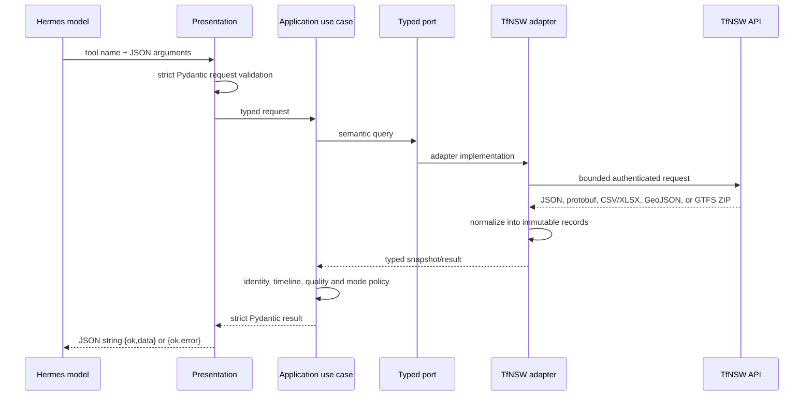

# How the plugin works

Hermes Sydney Transport is a bounded data pipeline. Each layer owns one concern and
communicates through typed contracts. This page explains runtime behavior; the
[architecture contract](architecture.md) defines the rules enforced in CI.

## Plugin discovery and registration

The repository supports the two official reusable Hermes distribution forms:

- native directory plugin: repository-root `plugin.yaml` plus `__init__.py` with
  `register(ctx)`;
- Python distribution: `hermes_agent.plugins` entry point named `sydney-transport`.

Both routes call the same bootstrap registrar. It iterates one catalog of 22
`ToolSpec` records and registers generated schemas plus generic JSON handlers. There
is no second handwritten schema, handler or registration path.

Tools are opt-in. `TFNSW_API_KEY` is declared as a secret installation requirement,
checked again when tools are exposed, and validated at the composition root. The key
is supplied only in the `Authorization` header to allowlisted TfNSW origins.

## Request pipeline



Presentation owns model-facing validation and envelopes. Application code owns
transport policy, not wire parsing. Ports are consumer-owned protocols with frozen,
slotted records. Adapters own HTTP, protobuf, CSV/XLSX/ZIP, SQLite, endpoint macros
and provider-specific normalization. Bootstrap is the only composition root.

## Trip Planner pipeline

The JSON Trip Planner integration uses five fixed endpoints:

1. `stop_finder` resolves user-facing place names.
2. `coord` finds nearby transport locations.
3. `departure_mon` returns departure boards and realtime identifiers.
4. `trip` creates depart-after or arrive-by journeys.
5. `add_info` returns current alerts for the selected public-transport modes.

Each request uses endpoint-specific macros and allowlisted product classes for train,
bus, metro, light rail, and ferry. Mode lists default to train and bus for backward
compatibility.
The model cannot choose an upstream host, path, macro or arbitrary query flag.
Responses are normalized by the adapter, then policy code filters modes, ranks,
bounds and validates the canonical result.

## GTFS-Realtime pipeline

Realtime status requires an exact identity. The preferred path is:

```text
departure.properties.RealtimeTripId
    -> service_id
    -> GTFS-Realtime trip_id
    -> static GTFS trips.txt trip_id
```

Trip Planner `tripCode` is not a GTFS trip ID. When it is the only available value,
the resolver repeats a bounded departure lookup for `trip_code + stop_id (+ at)` and
accepts only one exact `RealtimeTripId` match.

The realtime repository fetches a mode-specific Trip Updates feed and, when needed,
a Vehicle Positions feed. A short thread-safe single-flight cache means concurrent
tool calls share one fetch/decode operation without a background polling thread. The
decoder crosses the adapter boundary only through immutable typed snapshots.

Application modules then run a linear pipeline:

1. Resolve exact service identity.
2. Select the matching realtime entity.
3. Join route, trip, stop and scheduled-stop context from static GTFS.
4. Build a planned/predicted stop timeline.
5. Apply train-, bus-, metro-, light-rail- or ferry-specific policy.
6. Derive current progress, next stop, changes, warnings and confidence.

Train, bus, metro, light rail and ferry feeds, static archives, indexes and caches
remain separate. Train-only TfNSW extensions are not projected onto other modes.
Stale or incomplete data lowers confidence and remains visible in the output.

## GTFS-Realtime Alerts v2 pipeline

Route disruptions and current accessibility warnings use GTFS-Realtime Alerts v2.
Unlike Trip Planner alerts, this feed covers five public-transport modes and
preserves exact source-feed provenance:

- `sydneytrains`
- `nswtrains`
- `buses`
- `regionbuses`
- `metro`
- `lightrail`
- `ferries`

The alerts adapter:

- fetches only allowlisted alerts feeds;
- decodes protobuf into immutable semantic `AlertRecord` values;
- validates feed counts and fails closed on incomplete upstream results;
- applies a short cache for repeated lookups;
- deduplicates deterministically without discarding source-feed provenance;
- sanitizes remote text and URLs before application policy sees it.

Route disruptions filter by mode, stop, route, trip, cause, effect and active time.
Stop accessibility can reuse the same alerts port for `effect=accessibility_issue`.

## Static accessibility pipeline

Stop accessibility does not infer facilities from realtime. It uses two bounded
static resources:

- location facilities;
- interchange lifts.

The adapter indexes both into SQLite for exact `stop_id` lookups, then optionally
joins current accessibility warnings from Alerts v2. Static inventory and current
warnings remain separate in the output because the presence of a lift in static data
never proves that the lift is currently operating.

## Complete GTFS timetable pipeline

Route timetable uses the Complete GTFS bundle rather than mode-specific realtime
schedule archives. The adapter:

- conditionally refreshes the Complete GTFS ZIP on a bounded interval;
- rejects redirects, oversized downloads, unsafe ZIP paths and oversized expansion;
- builds a bounded SQLite index in a temporary location;
- atomically replaces the previous index only after validation;
- applies service-date logic and calendar exceptions for exact route lookups.

The resulting route, trip and stop IDs are from the Complete GTFS namespace. The
application explicitly keeps that namespace separate from realtime `service_id`
values used by Trip Updates and Vehicle Positions.

Building the persistent index is a deployment-sized operation rather than a cheap
interactive lookup. The current official bundle is roughly 286 MB and produced a
roughly 515 MB SQLite index in about 28 seconds during verification. Reserve at least
1.36 GB of temporary working space and pre-warm this cache before latency-sensitive
route-timetable calls. Warm lookups use the persistent index.

## Live Traffic hazards pipeline

Live Traffic hazards consume current `/open` GeoJSON hazard feeds only. The adapter:

- uses strict wire Pydantic models for FeatureCollection, Feature and properties;
- rejects malformed or oversized upstream GeoJSON responses;
- exposes only allowlisted hazard categories;
- supports either coordinate+radius proximity or exact suburb filtering;
- sanitizes advisory prose and external web links;
- preserves current network-impact semantics instead of guessing travel times.

These tools report operational incidents and planned hazards that are already
affecting traffic. They are not route planners.

## NSW road traffic-count pipeline

The NSW Roads API exposes a PostgreSQL-shaped `q` parameter. Passing caller SQL would
create an unnecessarily powerful and difficult-to-audit tool, so the public contract
contains only semantic fields such as station, year, date range, direction and
dataset.

The adapter maps those fields to fixed tables, columns, predicates and ordering.
Text literals pass one bounded encoder and every query has a hard row limit. Results
are normalized into station, yearly-summary or 24-hour row models while retaining
source quality and partial-year evidence.

## Failure and trust boundaries

- Input errors return `invalid_argument` before network access.
- Missing configuration returns `missing_configuration` without exposing the key.
- Authentication, rate limit, timeout and upstream contract errors use stable error
  codes and bounded messages.
- Authenticated redirects are rejected; the key cannot be replayed to another host.
- Alert and hazard prose is treated as untrusted data and reduced to bounded text.
- Unsupported or missing data is not replaced with a convenient default.
- Every successful output is validated once more before serialization.

## Extension path

To add a capability, define its Pydantic request/result, add or reuse a semantic
port, write one application use case, implement the adapter method, add one
`ToolSpec`, and bind the capability in the composition root. The generic presentation
and registrar must remain unchanged.

`architecture.toml` and `scripts/check_architecture.py` enforce this direction. The
checker blocks parallel tool catalogs and registration, wrong-way imports,
infrastructure in policy layers, manual application timestamp parsing, untyped port
records, oversized modules, excessive branching, nested realtime loops, raw SQL
outside adapters and legacy package restoration.
